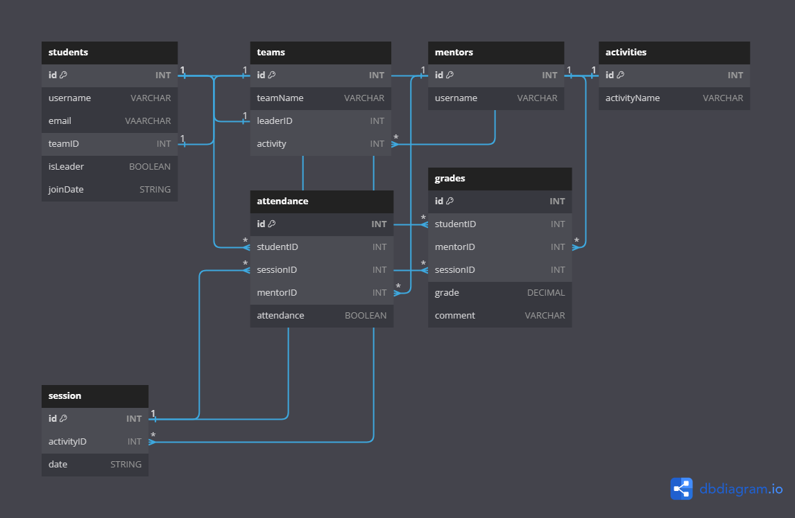
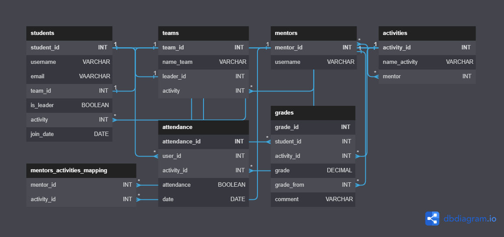

# Entity Relationship Diagram v3 (ERD)
[Click to see the associated DBML File](docs/db/erd3.dbml)

# Entity Relationship Diagram v2 (ERD)
[Click to see the associated DBML File](docs/db/erd2.dbml)

# Entity Relationship Diagram v1 (ERD)
[Click to see the associated DBML File](docs/db/erd.dbml)

# Swagger API documentation  
<!--v1 is this:https://i.imgur.com/PLWc6re.gif ; docs/api/openapi_v1.yaml -->
[Click to see the corresponding .yaml file](docs/api/openapi_v2.yaml)
